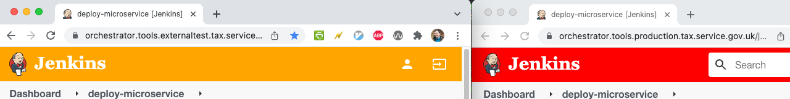

# Jenkins orchestrator warning

Changes the colour of the Jenkins header when visiting Externaltest (orange) or Production (red) orchestrator Jenkins.

# Installation
1) Clone this repo. Go to Manage Extensions section of chrome (chrome://extensions/)
2) Ensure 'Developer Mode' is enabled
3) click 'Load unpacked' and select the cloned directory

Visit either:
 - https://orchestrator.tools.externaltest.tax.service.gov.uk/
or
 - https://orchestrator.tools.production.tax.service.gov.uk/

 and behold!

